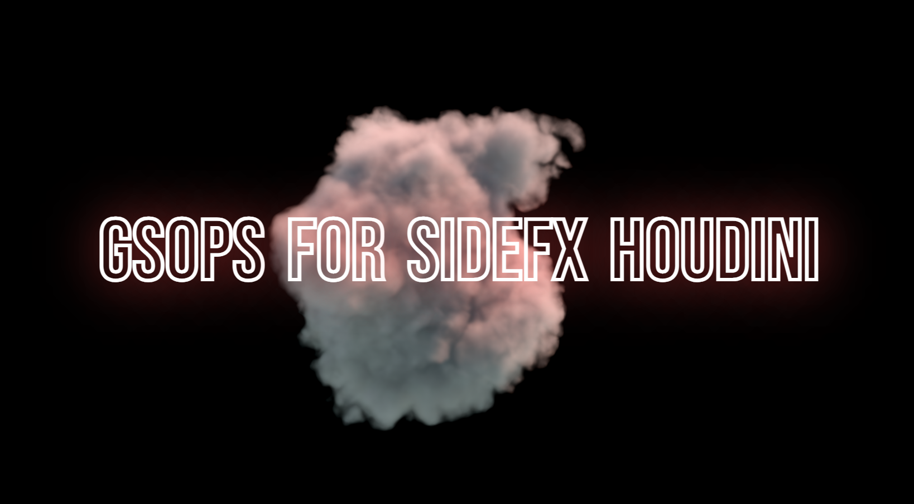

# GSOPs (Gaussian Splatting Operators) for SideFX Houdini 20.5
_GSOPs is now available with a **Houdini Commercial** license._

[Watch the GSOPs Showcase](https://www.youtube.com/watch?v=5V7mBuVxlt4)

## About
GSOPs is a collaborative project from [David Rhodes](https://www.linkedin.com/in/davidarhodes/) and [Ruben Diaz](https://www.linkedin.com/in/rubendz/). It is comprised of a [viewport renderer](https://github.com/rubendhz/houdini-gsplat-renderer), [example files](https://github.com/david-rhodes/GSOPs/tree/develop/hip), and several digital assets to assist with common I/O and editing operations for 3DGS content. GSOPs is developed in our personal time and is provided as-is. 

Use GSOPs to import, render, edit, and export 3D Gaussian splatting models, or to generate synthetic training data. Synthetic data is capable of producing high-fidelity models with view-dependent effects and performant rendering on most modern devices. GSOPs is effective at isolating objects, eliminating noise and floaters, deforming and animating splat models, composing scenes, meshing and relighting splats, and conducting feature analysis.

For more examples of GSOPs in action, check out [GSOPs on LinkedIn](https://www.linkedin.com/feed/hashtag/?keywords=gsops) and [GSOPs on YouTube](https://www.youtube.com/playlist?list=PLBC-5xO_PccbefAB35xGOmAmWFRXLPDCo).

**🥉 GSOPs won 3rd place in the [H20 SIDEFX LABS Tech Art Challenge](https://www.sidefx.com/community-main-menu/contests-jams/h20-tech-art-challenge/).**

[Join us on Discord!](https://discord.gg/bwsvvRYNJa)

## Motivation
Houdini's powerful, data-efficient architecture makes it the go-to platform for procedural content production across many industries. Its flexible and extensible design empowers users to tackle complex challenges at the right level of abstraction, focusing on problem-solving rather than low-level technicalities.

This unique combination of flexibility and ease of use is especially valuable in the rapidly evolving field of Novel View Synthesis. It enables quick prototyping, testing, and refinement of new workflows, keeping pace with the latest research. Additionally, it provides a direct path for innovations to transition into real-world applications within a well-established, production-ready solution.

SideFX, the developer of Houdini, fosters innovation through its "Labs" initiative. This incubator allows for the iteration of new tools and workflows before they become mainstream. Similarly, GSOPs provides a dedicated playground for Novel View Synthesis, enabling users to craft new workflows that closely align with the final visual result while prioritizing a creative and enjoyable process.

We're passionate about the potential of editable radiance fields in SideFX Houdini and we're eager to continue pushing boundaries. If you believe in this initiative or have benefitted from GSOPs, please consider supporting us with contributions, feedback, or donations. Thank you! 

## SOP Nodes
For more information regarding any of the following nodes, please reference the built-in help cards. *(SideFX, if you are reading this, thank you for making an incredible documentation system!)*

* `gaussian_splats_align_by_points`: Aligns a gaussian splat model to the world origin.
* `gaussian_splats_crop`: Crops or groups a splat model.
* `gaussian_splats_dbscan`: Density-based spatial clustering useful for removing noise and outliers.
* `gaussian_splats_deform`: Deform splat models using polygonal geometry.
* `gaussian_splats_export`: Exports Houdini gaussian splat geometry to disk, converting all relevant point data to native gaussian splat attributes in the process.
* `gaussian_splats_feature_analysis`: Perform statistical analysis of gaussian splat models.
* **[UPDATED]** `gaussian_splats_generate_training_data`: Generate synthetic data suitable for training gaussian splat models. _Added png image support for Alpha-masked training in Postshot and NerfStudio/Gsplat, as well as COLMAP txt export for improved debugging._
* **[NEW]** `gaussian_splats_hald_clut`: Apply color adjustment to splats based on [Hald Color Look-Up Tables](https://www.quelsolaar.com/technology/clut.html).
* `gaussian_splats_import`: Loads a trained gaussian splat model, converting all relevant data to native Houdini point attributes.
* `gaussian_splats_import_cameras`: Imports the cameras.json file generated as a result of training gaussian splat models.
* `gaussian_splats_relight_ibl`: Relight gaussian splat models using image-based lighting techniques.
* **[UPDATED]** `gaussian_splats_transform`: Translate, rotate, and scale splats. _New and improved user experience and support for splat scaling!_
* `gaussian_splats_visualize_boxes`: Visualize gaussian splats as opaque boxes.
* **[NEW]** `GSplat Source`: Converts point geometry (as defined by `gaussian_splats_import`) into "GSplat" primitives, enabling their rendering in the viewport.

## Notes
* Please be kind. We love innovating and learning, and we want you to benefit from this project.
* GSOPs is only supported for Houdini 20.5. This is due to an API change in the HDK. You should still be able to customize your installation for Houdini 20.0 and continue using the digital assets.
* We provide precompiled binaries of [`houdini-gsplat-renderer`](https://github.com/rubendhz/houdini-gsplat-renderer) for Houdini 20.5 on Windows and MacOS. Linux is not officially supported, but you can attempt to compile it yourself. 
* Please adhere to the [SideFX Houdini License Agreement](https://www.sidefx.com/legal/license-agreement/).
* GSOPs can generate gaussian splat training data, but it cannot train models. If you want to train models locally, please see [3D Gaussian Splatting for Real-Time Radiance Field Rendering](https://github.com/graphdeco-inria/gaussian-splatting) or [Postshot](https://www.jawset.com/).
* If you're interested in what you've seen and would like to discuss innovation/R&D collaboration opportunities, please contact us.

## Installation
1. For the latest and greatest, clone this repository (`develop` branch). Alternatively, for a more stable build, download the [latest release](https://github.com/david-rhodes/GSOPs/releases).
    * **Either clone with `--recurse-submodules`, or run `git submodule init` followed by `git submodule update`**. 
    * If you have separately installed [houdini-gsplat-renderer](https://github.com/rubendhz/houdini-gsplat-renderer), **it is recommneded to delete existing compiled binaries to avoid plug-in conflicts!**
2. Copy the `packages` directory found in the repository root, and paste it in the $HOUDINI_USER_PREF_DIR folder. [More information here.](https://www.sidefx.com/docs/houdini/ref/plugins.html)
3. Open the GSOPs_20.5.json file inside the `packages` directory you just pasted. Modify the "GSOPS" path found inside to the the location used in step one.
4. Install the latest [SideFX Labs](https://www.sidefx.com/products/sidefx-labs/) release. 

## Getting Started
1. Open a few example scenes from the `hip` directory. Use these to validate your installation and better understand Gaussian splatting workflows.
2. For accurate color results, [disable OpenColorIO in the viewport](https://vimeo.com/1001396463). If you don't see your splats in the viewport, you may also need to disable viewport lighting.
3. The `GSplat Source` SOP (i.e., the "render" node) does not currently have an output. This means it must exist at the end of your network. (We intend to change this in the future so that it's embedded in the `gaussian_splats_import` SOP for a streamlined user experience.)
4. Houdini provides many wonderful tools that will help you work with Gaussian Splat data. If you're not already familiar, check out the following SOP nodes: point cloud normal/surface, VDB from particles/polygons, cluster, and group (w/keep in bounding regions).

## Splat Animation Sequences
* It's possible to export splat animation sequences (one .ply per file). You can load and render these in [Postshot](https://www.jawset.com/) and [Unity](https://github.com/david-rhodes/GSOPs/blob/develop/extra/UnityGaussianSplatting/INSTRUCTIONS.md).

## Synthetic Training Data
* You can use Houdini renders from procedural and manually generated camera poses (in COLMAP format) to convert your CG scenes to 3D Gaussian Splats. With GSOPs 2.0, png image support has been added to the `generate_training_data` SOP. This means you can train alpha-masked 3DGS models, producing cleaner reconstructions.

## Help
* All digital assets exist in the SOPS context and (most) have their own help card documentation.
* [Join us on Discord](https://discord.gg/bwsvvRYNJa).

## Known Issues
We consider GSOPs to be a professional-grade prototyping toolset. It is not free from error, and the user experience could be improved in many areas. Here are some of the known issues:

* Rotating a splat model will not update spherical harmonics data accordingly. As a result, view-dependent lighting effects will not behave correctly in exported models. **We hope this will be resolved in GSOPs 2.1**
* Rendering the viewport with `gaussian_splats_generate_training_data` will always use the viewport aspect ratio as the camera resolution aspect ratio (with a maxmium dominant resolution of 720 in Houdini Apprentice). This is because I could not find a python hook to set the viewport size. As a workaround, be sure to set your viewport size manually before performing viewport renders. As an alternative, you can render the scene using [flipbook](https://www.sidefx.com/docs/houdini/render/flipbook.html).
* It is possible to create bad export data when using the `unpack` feature of `gaussian_splats_visualize_boxes`. As a workaround, avoid having this node in any data stream leading to an export node.
* The`gaussian_splats_feature_analysis visualizer` sometimes fails to refresh (toggle the visualize button as a workaround), and this often precedes a Houdini crash. The UX when dealing with very small or large attribute values also needs improvement.
* There's quite a bit of python in the project which needs additional error handling.
   
## Contribution Wish List
We have not yet been able to implement all the cool ideas we have. However, in open-sourcing GSOPs, we hope to involve the community. After all, we're stronger together! Please [join us on Discord](https://discord.gg/bwsvvRYNJa)! 

Here's our wish list for community contributions (please feel free to bring your own ideas, too):
- [x] Viewport Renderer (Thanks, [Ruben](https://github.com/rubendhz)!)
- [x] [Splat lighting toolkit](https://www.youtube.com/watch?v=5-oFqtbg6xM).
- [ ] I/O for compressed splats. One approach may be [Niantic's SPZ format](https://github.com/nianticlabs/spz).
- [ ] Karma/LOPS render support.
- [ ] [Segment Any 3D GAussians (SAGA)](https://github.com/Jumpat/SegAnyGAussians) or similar segmentation integration.
- [ ] Custom python viewer states + "magic wand" functionality (e.g., spatial-aware selection according to attribute similarity).
- [ ] PDG/TOPS support for batching and automation (probably to generate synthetic training data with `gaussian_splats_generate_training_data`).
- [ ] Improved camera coverage generator for `gaussian_splats_generate_training_data`. The first-pass (object-centric) implementation is somewhat naive. It would also be great to have a camera coverage solver for environments.
- [ ] Icons (the current icons are borrowed from SideFX, but custom icons would be great).
- [ ] Promotional material (graphic design or other content you make using GSOPs).

## Acknowledgements
Thank you, community! Your support, interest, and rapid contributions to gaussian splatting have inspired and motivated us. 

### From David
[Jonne Geven](https://www.linkedin.com/in/jonne-geven/) and [Antti Veräjänkorva](https://www.linkedin.com/in/anttiv79/) have been my "rubber ducks." Thanks, guys. Always helpful to have cool people to bounce ideas around with.

[Aras Pranckevičius](https://aras-p.info) was quick to adopt Gaussian Splatting with a [Unity implementation](https://github.com/aras-p/UnityGaussianSplatting). He also went out of his way to help me with several problems I encountered during development. Thank you, Aras!

Major kudos to the original inventors of Gaussian Splatting, [Inria and the Max Planck Institut for Informatik (MPII)](https://repo-sam.inria.fr/fungraph/3d-gaussian-splatting/)! 

### From Ruben 
I don't think I would have gotten this far without the inspiration from so many amazing open-source projects. I’d like to highlight two in particular; although I haven’t directly reached out to the authors, their work has been massively helpful, so I want to give special kudos to them:

- https://github.com/aras-p/UnityGaussianSplatting
- https://github.com/antimatter15/splat

## Final Thoughts
This project is licensed under a _copyleft_ AGPL-3.0 license. If you require a different arrangement, please contact us to discuss alternatives.

Also, if you create something cool and share it on social media, we'd love to see. Please consider tagging us!

**Keep splatting!** 
